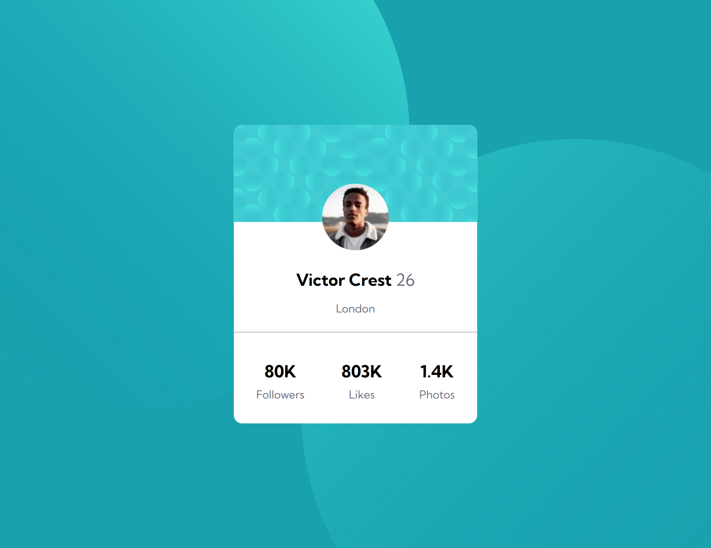

# Frontend Mentor - Profile Card Component

This is a solution to the [Profile Card Component challenge on Frontend Mentor](https://www.frontendmentor.io/challenges/profile-card-component-cfArpWshJ). Frontend Mentor challenges help you improve your coding skills by building realistic projects.

## Overview

### Screenshot

### Links

- Live Site URL: [https://yourusername.github.io/profile-card-component/](https://telmomanduco.github.io/profile-card-component-main/)

## Built with

- Semantic HTML5 markup
- CSS custom properties
- Flexbox
- Positioning and background images
- Responsive layout

## What I learned

In this project, I practiced:

- Absolute positioning to overlay the profile image
- Using multiple background images with precise positioning
- Centering elements using Flexbox
- Structuring HTML for accessibility and simplicity

## Author

- Frontend Mentor – [@TelmoManduco](https://www.frontendmentor.io/profile/TelmoManduco)
- GitHub – [@TelmoManduco](https://github.com/TelmoManduco)

